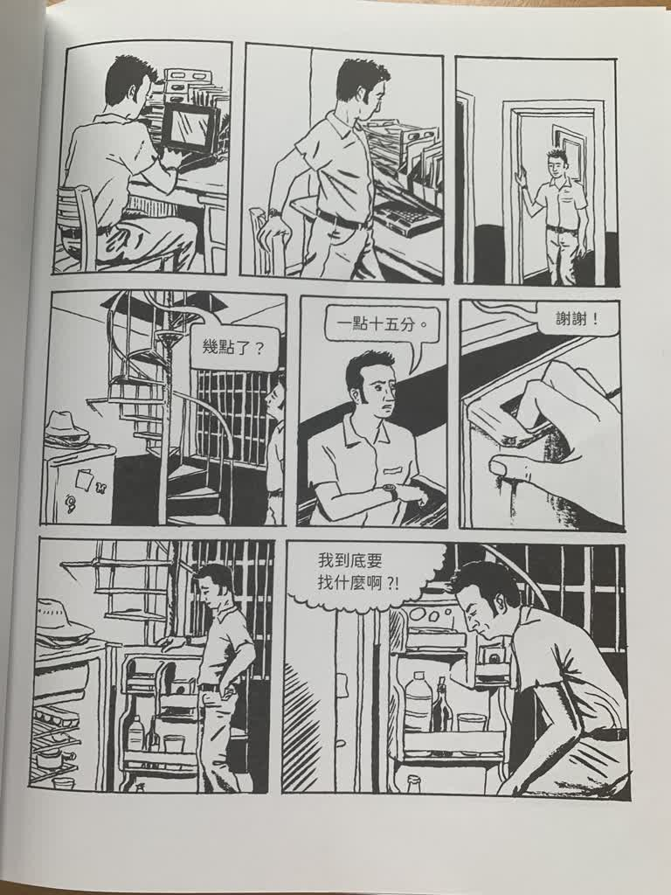
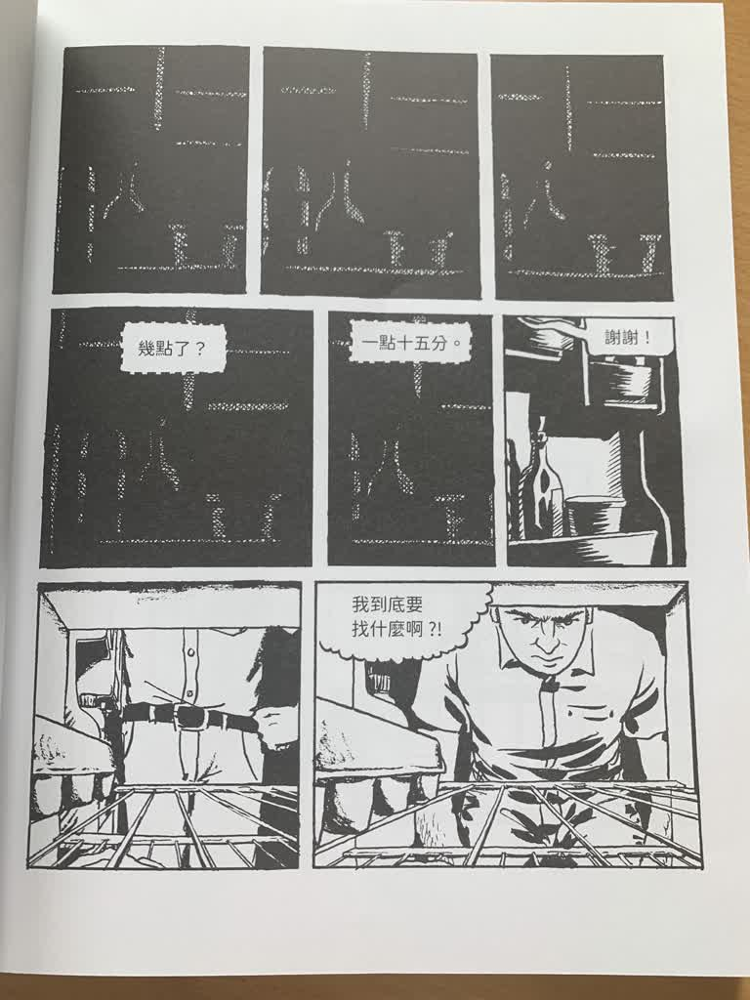
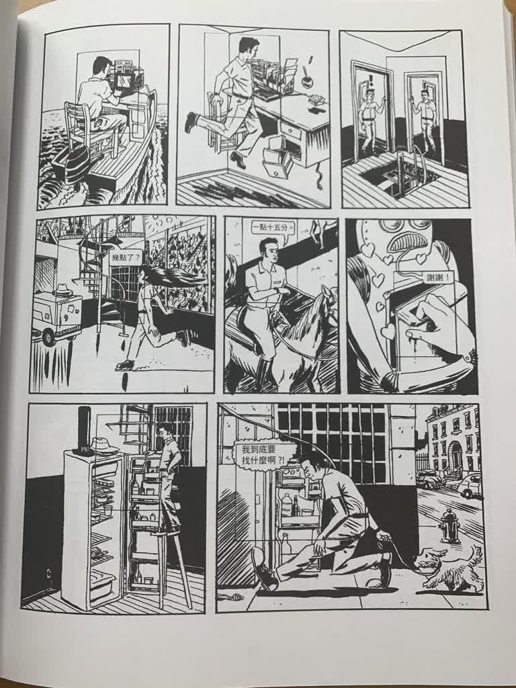
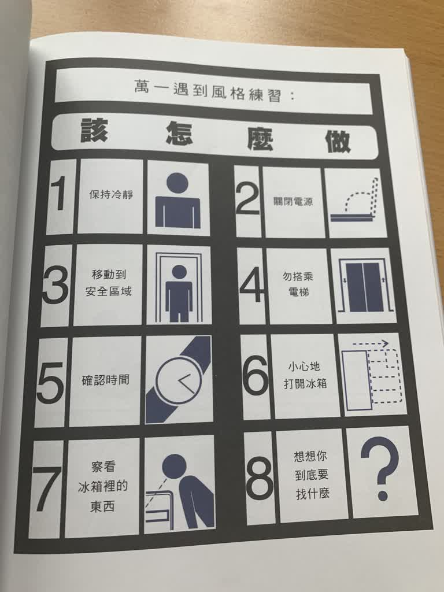

+++
date = '2025-09-09T06:00:00+08:00'
draft = false
title = '一個故事各自表述'
+++

最近在圖書館翻到[這本書](https://en.wikipedia.org/wiki/99_Ways_to_Tell_a_Story:_Exercises_in_Style)，感覺很有趣。

作者用一張漫畫劇本，對它做了九十九種不同的變形，在這裡精選幾張我覺得超讚的改編。

## 原稿

## 冰箱視角

## 日本漫畫

## 天馬行空

## 指示

## 地圖

---

感覺這一種圖文有點難重現我當時看到的感動呢。

---

