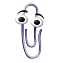

+++
date = '2025-09-04'
draft = true
title = '📎'
+++

長話短說，反正就是我在逛 YouTube 的時候發現很多人用下面這隻迴紋針當做頭貼。

當時也沒想什麼[^1]，後來誤打誤撞[^2]才知道這件事的起因如下。

---

有一位叫做 Louis Rossmann 的 YouTuber 透過[這一個影片](https://youtu.be/2_Dtmpe9qaQ)發起的，起因是他看到一則新聞說有個小女孩自拍了一張穿新衣服的照片上傳發布後又刪除了，後來見到這件事就推測是一個自信低下的人嘛，給廣告商這個資訊給地下更多流行衣服的廣告，於是他就這樣行動就是對這些大公司這些社群軟體對人們的自由權控制權隱私權的玩弄發起的不合作運動，以更換統一的頭貼形式讓AI無法偷窺人們對頭貼的創作想像力，
會發起更改頭像運動的原因，是為了抵制社群軟體對個人隱私的侵犯，

這是一個對當代社群軟體和 AI 的反抗行動

藉由將頭貼換成這隻迴紋針，來呼籲表示自己已經受夠社群軟體和 AI 對個資的侵犯和利用的這一切
我也不是很清楚這個迴紋針的來歷，所以來抄一下維基：

> Office 小幫手（英語：Office Assistant）是指曾經內建於 Microsoft Office 的一套智慧型使用者介面，旨在幫助使用者更高效地使用 Office 軟體，解決各種常見問題。

至於為何選擇 Clippy 作為這次運動的代表，簡言之要用 Clippy 作為善良純真的化身，來對比現代社群軟體過度算計的存在。

> He might have been annoying, but he just wanted to help. There were no ulterior motives. If you told Clippy that you were having a bad day, he wasn't going to use that information to try and figure out which advertiser to sell you to, nor was he trying to steal your personal data or get you to purchase other Microsoft products. He had no ulterior motives. He was simply there to help. 
>
> 你可能會覺得 Clippy 很煩，但他只是想要幫助你，並沒有其他隱藏起來的動機。如果你跟他講說你過了一個痛苦的一天，他不會用這一個資訊去算計要推送哪一些廣告給你，也不會偷走你的個資或逼你去購買其他微軟的產品。他沒有心機。他只是想要幫助你。

---

我覺得最有趣的部分，就是 Clippy 頭貼並無法限制人們的創意

曝光度的話，我問我妹（她不大看英文類別的）她說她也沒有在 YouTube 上看到迴紋針，去查中文的部分似乎也沒什麼新聞，可惜了。我就不換頭貼了，不過就用這個文章多少補償一下。

[^1]: 當時是在嘗試 [FreeTube](https://freetubeapp.io/) 時發現的，當時只想說：「酷欸， FreeTube 的原始頭貼是長這樣喔？」

[^2]: 我把從手機刪掉的 YouTube 下載回來，想說已經有一段時間沒有接受被滿版鋪天蓋地的廣告和短片推薦摧殘了，回來體驗一下（怪人），然後演算法就推給我了[這一部影片](https://youtu.be/0xAGUrkDsj4)

