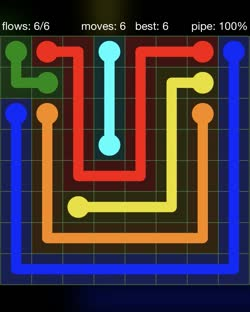
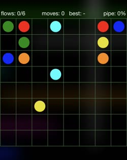
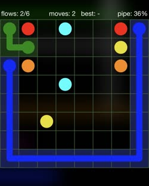
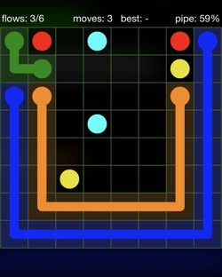
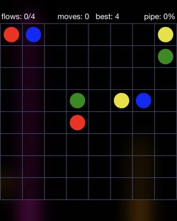
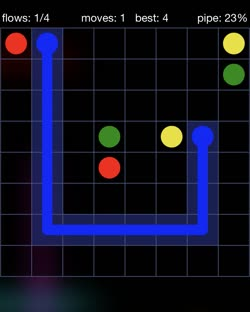
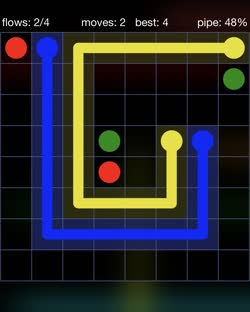
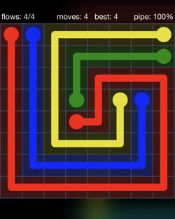

+++
date = '2025-10-03T09:57:26+08:00'
draft = false
title = 'Flow Free'
+++

來介紹一個小品解謎遊戲——[Flow Free](https://www.bigduckgames.com/flowfree)。

## 認識 Flow Free
Flow Free 是一個很基本的連連看解謎遊戲，要把同一個遊戲的關卡成對的兩個顏色相連，並且同一個不同的顏色不能交叉。

我從國小就知道這個遊戲了，我想這一個種類的遊戲它應該是始祖之一吧。它的介面是我玩過的同類型遊戲中，做的最流暢最棒的，而且從簡單的到相對困難的關卡它都有。

---

## 破解 Flow Free

接下來請容許我傳授玩 Flow Free 這麼多年下來的心法。

要破解所有 Flow Free 關卡的方法很簡單，只有一個原則：**貼著牆壁走**。

這裡的牆壁指得可能是關卡的邊界，也可以是其他完成連線的線條。只要照著這個原則，就不會讓線條像個無頭蒼蠅橫衝直撞，也可以確保不會在連線時碰到死路了。

### 簡單關卡範例

以這一個關卡為例子，可以看到現在深綠色和深藍色可以貼著牆壁走。

完成這兩個顏色後，可以發現橘色可以貼著深藍色走了。

剩下的就簡單啦。

### 困難關卡範例

接著來以這關當做例子，可以非常傷心地發現沒有邊可以貼了。不過可以觀察到，以左上角的藍色而言，看似三個方向可以走，但是其實只有一個可行。

1. **從右上連接**：黃色會被堵住，所以不行。
2. **從綠色和黃色的中間穿過去**：如果接著再連接綠色，紅色就被堵住了，所以也不行。
3. **往下走**：只剩下這個選項了。

走這一條路，只需要留意不要擋住旁邊的紅色就行了。也就是說，只要確保旁邊的紅色也有一條且唯一一條路可以走，然後**貼著**預計給紅色走的路，就可以將藍色完成了。

然後黃色就有邊可以貼了。

剩下的就簡單啦。

只要領略以上心法，Flow Free 八九成的關卡都不是問題啦！
